# Análise de documentos: DeepSeek

## Técnica de elicitação de requisitos: Análise de documentos

Pode-se definir a técnica de elicitação de análise de documentos como:

> “... um meio de elicitar requisitos pelo estudo de documentação disponível sobre uma solução existente para identificação de informação relevante para o desenvolvimento de uma nova solução” (VAZQUEZ; SIMÕES, 2016).

Nesse sentido, o termo “documentação” possui um significado mais amplo do que as especificações de requisitos do projeto, a documentação também inclui documentos sob o domínio do problema, os quais permitem alcançar os objetivos de informação presentes nos momentos iniciais (VAZQUEZ; SIMÕES, p. 149)

A análise de documentos possui dois objetivos principais, identificar as partes interessadas e as necessidades de negócio (VAZQUEZ; SIMÕES, p. 149). Nesse sentido, ela será utilizada para elicitar requisitos do app DeepSeek, esses requisitos podem ser funcionais ou não-funcionais, também podem já estar implementados ou ainda não. Além disso, com base na análise de documentos, será possível discutir sobre características dos usuários do app facilitando a criação de um perfil de usuário.

### Documentos analisados:

Para essa técnica foram escolhidos três documentos diferentes:
1. A página do app DeepSeek na Play Store: por apresentar o primeiro contato do usuário com a versão mobile do DeepSeek;
2. A página da API do DeepSeek: por possuir uma apresentação geral do aplicativo para o público mundial;
3. O relatório técnico do DeepSeek-V3: por discutir a criação e desenvolvimento do modelo DeepSeek-V3 o qual é utilizado no aplicativo mobile.

Além disso, será possível discutir sobre as características dos usuários do app, facilitando a criação de um perfil de usuário.

### Documentos analisados:
1. Página do app DeepSeek na Play Store;
2. Página da API do DeepSeek;
3. Relatório técnico do DeepSeek-V3.

---

## Página da Play Store do DeepSeek

### Resumo do documento

O primeiro documento a ser analisado é a página do aplicativo DeepSeek na loja de aplicativos do Android. Nela, existe um breve resumo do aplicativo, mostrando as funcionalidades, existe também uma sessão mais técnica que mostra em qual versão o aplicativo está e qual a quantidade de memória que ele gasta ao instalá-lo.
 
Além disso, é possível ver imagens que mostram as principais funcionalidades da versão mobile do DeepSeek.

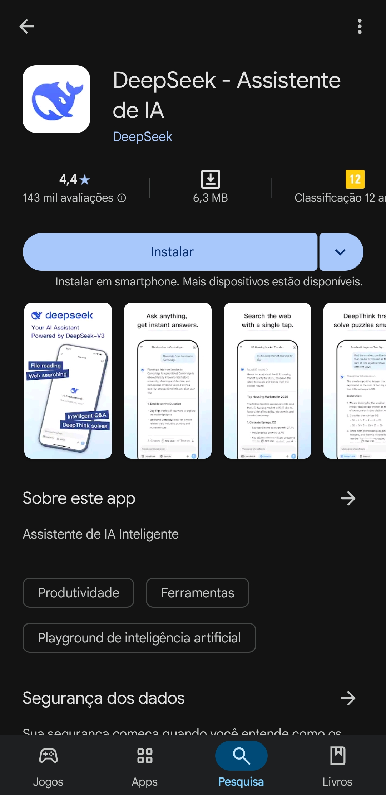

Nas imagens do aplicativo é possível ver como é a interface do DeepSeek mobile e exemplos de prompts que ele é capaz de responder. Além disso, nota se que app está sob as categorias de produtividade, ferramentas e playground de inteligência artificial.

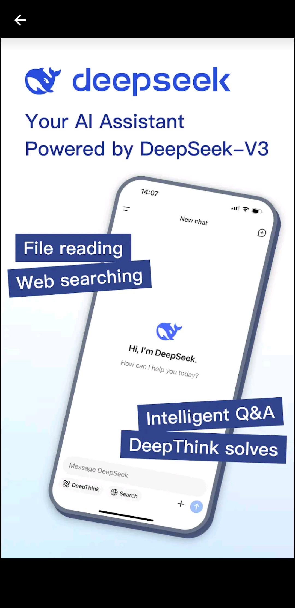

A primeira delas, traz um breve resumo com as principais funcionalidades, sendo elas:
1. Leitura de arquivos;
2. Pesquisa na web;
3. Perguntas e respostas inteligentes;
4. Pensamento profundo.
Também é possível ver o layout do aplicativo no fundo.

A segunda imagem busca mostrar um prompt comum, em que o usuário pede para a IA planejar uma viagem de Londres para Cambridge. Em destaque é possível ver que a principal vantagem retratada da imagem são as respostas “instantâneas” do modelo para qualquer pergunta.

A terceira imagem mostra o usuário utilizando a função de pesquisa do aplicativo, em que a IA faz uma pesquisa na web em busca de conteúdos semelhantes à pergunta feita pelo usuário. 

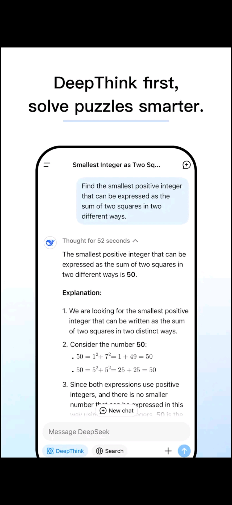

Já na quarta imagem é possível que a função DeepThink está ativada, em que a IA leva um tempo maior para processar a pergunta e responder o usuário. Nesse caso ela é utilizada para um problema de matemática, mas também pode ser utilizada para diferentes problemas. 

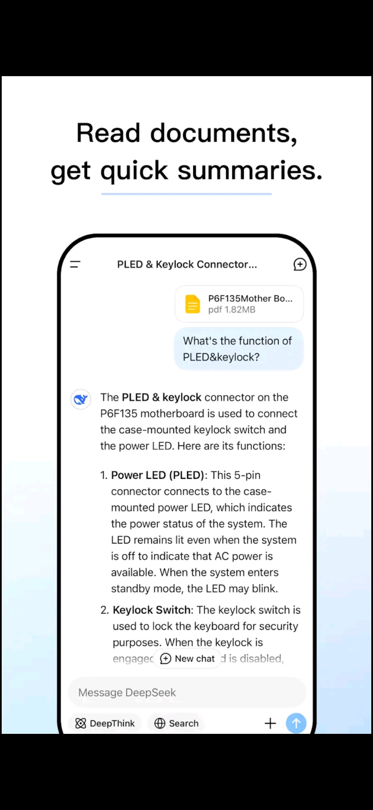

Por fim, na quinta e última imagem do app DeepSeek na PlayStore, é possível ver a funcionalidade de leitura de documentos do DeepSeek. Neste caso a IA lê o PDF e responde a uma pergunta relacionada ao que está escrito nele. Nesta situação não fica claro quais são as limitações da IA com relação a leitura de documentos, se ela é capaz de processar apenas documentos PDF ou outros tipos também.

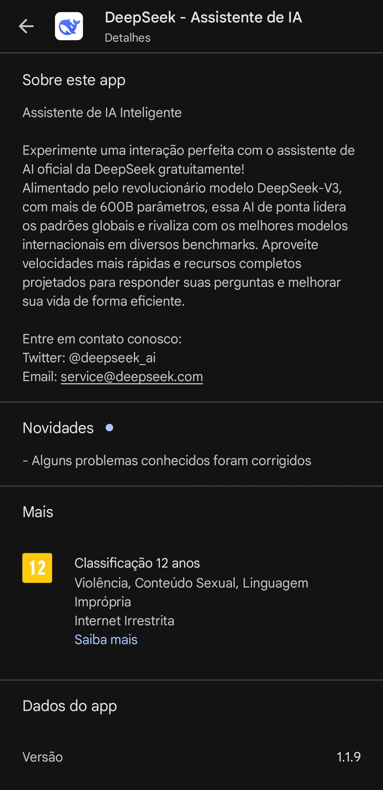

Por fim, é possível ler a descrição do aplicativo. Nela fica claro que o modelo utilizado para o aplicativo é o DeepSeek-V3, que foi alimentado por 600 bilhões de parâmetros. O texto também foca no fato do aplicativo ser gratuito para os usuários além de destacar os contatos com a empresa.

### Requisitos elicitados com base na análise do documento

| ID     | Descrição                                         | Tipo           | Fonte     |
|--------|--------------------------------------------------|----------------|-----------|
| RF01   | Pesquisa na Web de prompts do usuário            | Funcional      | Figura 4  |
| RF02   | Pensamento profundo para solução de problemas    | Funcional      | Figura 5  |
| RF03   | Leitura e interpretação de arquivos PDF          | Funcional      | Figura 6  |
| RNF01  | Utilização da arquitetura DeepSeek-V3            | Não-funcional  | Figura 7  |

### Características do perfil de usuário

Com base na análise da página, nota-se que o aplicativo do DeepSeek tenta atrair o máximo de pessoas possível para utilizar o app, são mostradas situações diversas em que o app pode ser utilizado. Na Figura 3, é apresentado o app como um ajudante para planejamentos de viagem, mas isso pode ser expandido para outros contextos como auxílio de estudos. Já na Figura 4, o modelo é utilizado para a checagem de fatos de forma rápida, o que pode atrair pessoas de áreas de pesquisa.Na Figura 5, o DeepSeek resolve um problema de matemática, podendo atrair estudantes de escolas e de nível acadêmico. Por fim, na Figura 6, o DeepSeek é utilizado para a leitura de um arquivo PDF, situação que também pode ser atrativa para estudantes e pesquisadores que precisam resumir documentos de forma mais rápida.  Vale lembrar que essas figuras ressaltam um dos tópicos em que o app está inserido na PlayStore, que é sob a categoria de produtividade.

### Conclusão do documento analisado

Além disso, é possível notar uma inconsistência entre a comunicação da empresa com os usuários. Na PlayStore são utilizadas imagens com textos em inglês mas na descrição do aplicativo o texto está em português. Isso pode dificultar com que novos usuários, que não saibam inglês, instalem o aplicativo dado que seriam capazes de ler apenas a descrição mas ficariam confusos com as imagens que mostram as funcionalidades. 
Outro ponto que deve-se levar em consideração é a análise de arquivos, em momento algum fica claro quais tipos de arquivos podem ser lidos pelo DeepSeek, isso também pode causar frustrações em usuários, uma vez que eles podem instalar o aplicativo pensando que um determinado tipo de arquivo que eles usam pode ser lido mas na realidade ele não é suportado pelo modelo.

---

## API do DeepSeek

### Resumo do documento

O próximo documento a ser analisado é o site de apresentação do DeepSeek, ele apresenta os conteúdos de forma semelhante a loja de aplicativos. 

Nele é possível ver que o DeepSeek também está disponível para dispositivos IOS além de ressaltar que o modelo utilizado no app é o DeepSeek-V3.

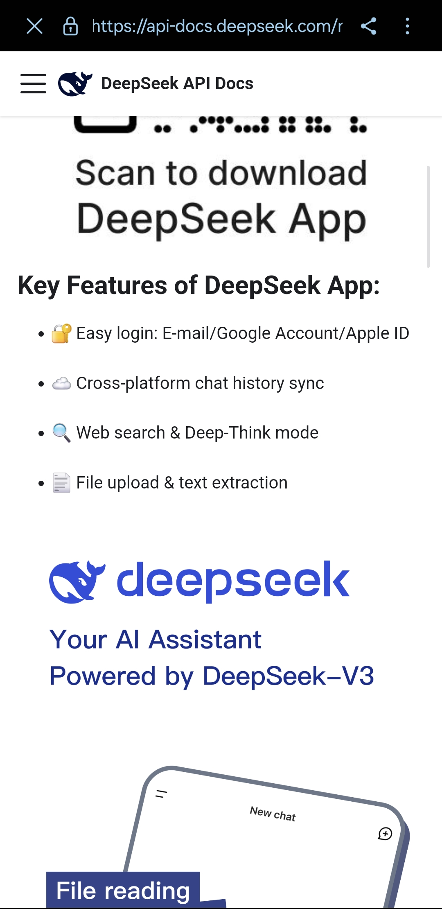

Logo em seguida, o site destaca as funções chave do aplicativo, sendo elas: login fácil com e-mail/conta do google/Apple ID, histórico do chat sincronizado entre plataformas, modos de pesquisa na web e pensamento profundo, upload de arquivos e extração de texto.

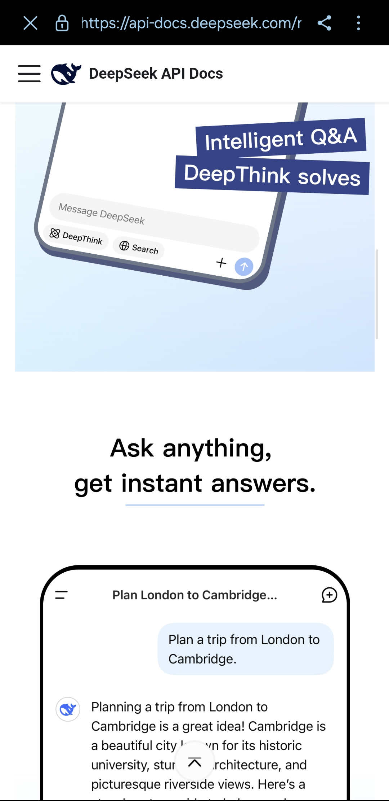

Depois, ele passa a utilizar as mesmas imagens presentes da Play Store para destacar as funcionalidades do aplicativo

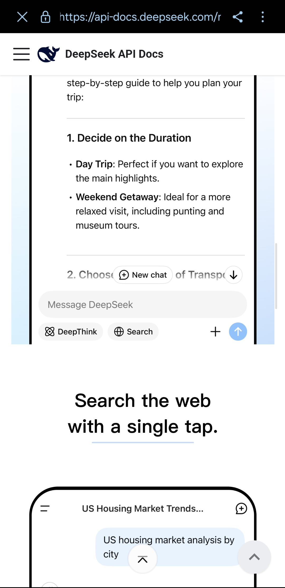

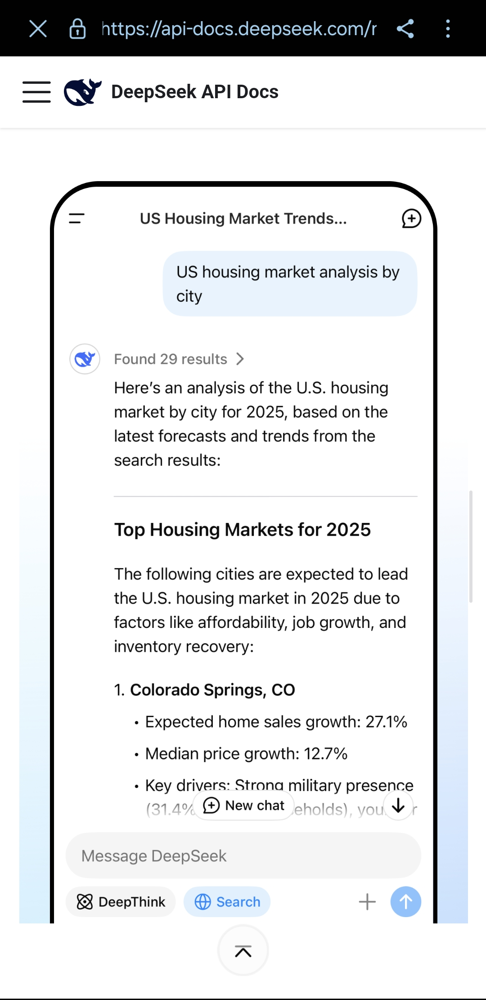

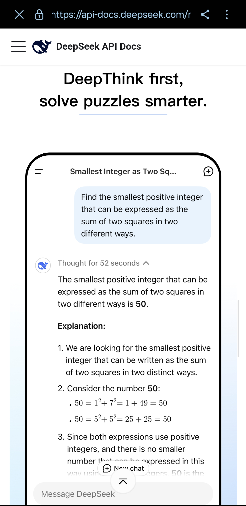

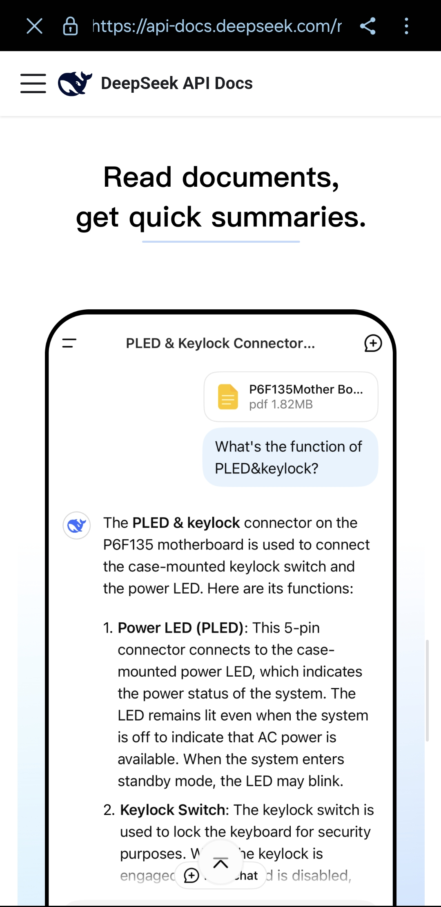

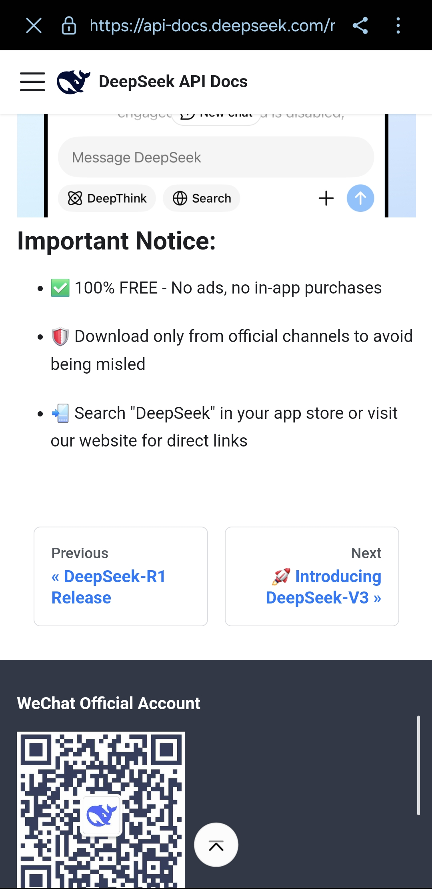

Por fim, o site destaca informações importantes do uso do aplicativo, sendo ele 100% gratuito para uso, sem propagandas e sem compras no app. Depois, é ressaltado a importância de fazer o download do aplicativo apenas de fontes conhecidas.

### Requisitos elicitados

| ID     | Descrição                                             | Tipo           | Fonte     |
|--------|------------------------------------------------------|----------------|-----------|
| RNF01  | Versões para Android e iOS                           | Não-funcional  | Figura 8  |
| RF01   | Login com conta Google/Apple ID                      | Funcional      | Figura 8  |
| RF02   | Salvamento de chat entre plataformas                 | Funcional      | Figura 8  |

### Características do perfil de usuário

Assim como a página do aplicativo na PlayStore, o site do DeepSeek mostra as principais funcionalidades do aplicativo, apresentando o uso da IA em diferentes cenários e como ela performa. Bem como na apresentação da PlayStore não é destacado quais são os tipos de arquivo suportados pelo DeepSeek contudo, não apresenta uma inconsistência entre a comunicação do usuário, dado que a página como um todo está em inglês. 

### Conclusão

A API do DeepSeek apresenta requisitos semelhantes aos presentes na página da Play Store, destacando as principais funcionalidades do app. Mas também foi possível elicitar novos requisitos, os quais estão presentes na Tabela 2, além de descobrir novas características do perfil de usuário do aplicativo.

---

## Relatório técnico do DeepSeek-V3

### Resumo do documento

Por fim, o último documento a ser analisado é o relatório técnico do DeepSeek-V3, nele é explicado o processo de desenvolvimento do modelo, descrevendo os dados que foram utilizados para o treino do modelo, uma priorização em criar um modelo eficiente em termos de poder de processamento de placas de vídeo. Além disso, a arquitetura do modelo e suas funcionalidades também são discutidas e quais tecnologias são utilizadas para o DeepSeek-v3. 

É possível elicitar vários requisitos com relação ao desenvolvimento do modelo, que se dividem em funcionais e não funcionais, eles são vistos na Tabela 3.

### Requisitos elicitados (exemplos)

| ID     | Descrição                                                                                     | Tipo           | Status           | Página |
|--------|-----------------------------------------------------------------------------------------------|----------------|------------------|--------|
| RF01   | O DeepSeek V3 deve utilizar Multi-Token Prediction para melhor eficiência no seu treinamento  | Funcional      | Implementado     | p. 4   |
| RF02   | O modelo deve usar arquitetura DeepSeekMoE com balanceamento sem perda auxiliar               | Funcional      | Implementado     | p. 6   |
| RF03   | O sistema deve empregar a atenção Multi-Head Latent Attention para inferência eficiente       | Funcional      | Implementado     | p. 7   |
| RF04   | O modelo deve ser treinado com 14.8 trilhões de tokens diversos e de alta qualidade           | Funcional      | Implementado     | p. 22  |
| RF05   | O modelo deve realizar Fine-Tuning supervisionado e Reinforcement Learning                    | Funcional      | Implementado     | p. 28  |
| RNF01  | O treinamento deve ser realizado com precisão mista FP8 para eficiência e economia de memória | Não-funcional  | Implementado     | p. 14  |
| RNF02  | O treinamento deve ser feito com sobreposição de comunicação e computação (DualPipe)          | Não-funcional  | Implementado     | p. 4   |
| RNF03  | O sistema deve ser treinado com custo econômico (~$5.6M USD em horas de GPU)                  | Não-funcional  | Implementado     | p. 5   |
| RNF04  | O modelo deve ser escalável sem aumentar significativamente o custo de comunicação            | Não-funcional  | Implementado     | p. 14  |
| RF06   | O sistema pode vir a adotar estratégia de redundância dinâmica com seleção de experts         | Funcional      | Não implementado | p. 19  |
| RF07   | O sistema deve superar as limitações arquiteturais do Transformer                             | Funcional      | Não implementado | p. 35  |
| RF09   | O modelo deve integrar novos tipos de sinais de treinamento além do texto                     | Funcional      | Não implementado | p. 33  |
| RF10   | O modelo deve melhorar suas capacidades de "deep thinking"                                    | Funcional      | Não implementado | p. 36  |
| RNF05  | Investigar suporte completo para quantização em blocos de atenção                             | Não-funcional  | Não implementado | p. 47  |
| RNF06  | Desenvolver métodos mais completos e multidimensionais de avaliação                           | Não-funcional  | Não implementado | p. 22  |

### Características do perfil de usuário

Outro ponto interessante do relatório de desenvolvimento do DeepSeek-V3 é no que se refere às características de perfil de usuário. Como abordado no documento, o modelo possui uma base forte em conhecimento matemático e criação de código (DEEPSEEK-AI, 2024, p. 5), isso indica que ele pode ser ideal para usuários técnicos e desenvolvedores de códigos. Além disso, o DeepSeek-v3 possui uma grande performance em benchmarks como MMLU-Pro e GPQA-Diamond, os quais são testes voltados para avaliar o conhecimento educacional e de nível PhD (DEEPSEEK-AI, 2024, p. 6), assim o DeepSeek pode atrair atenção de usuários acadêmicos e educacionais devido a sua performance.

Ademais, o modelo é treinado majoritariamente em inglês e chines, mas também é avaliado em benchmarks multilingues (DEEPSEEK-AI, 2024, p. 24), assim, o modelo pode ser utilizado por diferentes usuários de diversas localidades. 

Por fim, fica descrito no documento que o modelo DeepSeek-V3 passa por uma fase de Fine-Tuning supervisionado e Reinforcement Learning para alinhar as às preferências humanas e fornecer respostas com clareza, concisão e verificação de raciocínio (DEEPSEEK-AI, 2024, p. 28–29). Isso mostra uma preocupação com interação natural, utilidade e confiabilidade de resposta, pontos que são ideias para os usuários que desejam uma maior personalização e controle.

### Conclusão do documento analisado

O relatório do DeepSeek é o documento que mais apresenta requisitos, contudo sua grande maioria está relacionada com o desenvolvimento do modelo em si, e não do aplicativo e com ele interage com o usuário. Com isso não faz sentido estudar os requisitos presentes no relatório, dado que o objetivo da disciplina está voltado para o app DeepSeek.
Contudo, o relatório mostra grandes indícios de qual é o público alvo do DeepSeek, que é de grande ajuda para a criação de um perfil de usuário para o projeto e até para a criação de personas.

---

## Considerações Finais

Foram analisados três documentos: A página do DeepSeek na PlayStore, a API do DeepSeek e o relatório de desenvolvimento do modelo DeepSeek-V3. Os dois primeiros foram os que mais trouxeram requisitos úteis para o projeto da disciplina, dado que mostram algumas das principais funcionalidades do aplicativo. Já o relatório provou ser técnico de mais para a disciplina, destacando assim o desenvolvimento do modelo em si e não em como ele interage com o usuário.

Além disso, pode-se encontrar características do perfil de usuário do app DeepSeek, sendo voltado para estudantes da área de exatas e desenvolvedores, devido a maior capacidade do DeepSeek de resolver problemas lógicos. É mostrado também que o app traz um maior controle para o usuário, apresentando uma interação natural e maior confiabilidade nas respostas.

---

## Referências

1. VAZQUEZ, E.; SIMÕES, G. *Engenharia de requisitos: software orientado ao negócio*. 1. ed. Rio de Janeiro: Brasport, 2016.  
2. DEEPSEEK. *Página do aplicativo DeepSeek na Play Store*. Disponível em: <https://play.google.com/store/apps/details?id=com.deepseek.chat>. Acesso em: 1 maio 2025.  
3. DEEPSEEK. *API do DeepSeek*. Disponível em: <https://api-docs.deepseek.com/news/news250115>. Acesso em: 1 maio 2025.  
4. DEEPSEEK-AI. *DeepSeek-V3 Technical Report*. 2024. Disponível em: <https://arxiv.org/abs/2412.19437>. Acesso em: 1 maio 2025.  

## Link do documento em PDF

<https://docs.google.com/document/d/11YFLgDrjwQGwquQmtuM5PnXQ0yMlqD_vVsqpfcJqIz0/edit?usp=sharing>

## Link do PDF do relatório técnico do DeepSeek

<https://docs.google.com/document/d/11YFLgDrjwQGwquQmtuM5PnXQ0yMlqD_vVsqpfcJqIz0/edit?usp=sharing>  

| Data       | Versão | Descrição                                                         | Autor                                            | Revisor                                        |
|------------|--------|-------------------------------------------------------------------|--------------------------------------------------|------------------------------------------------|
| 02/05/2025 | 0.1    | (#A01) Documentação referente à aplicação da técnica de análise de documentos. | [@Luiz](https://github.com/luizfaria1989)        | [@Ana Joyce](https://github.com/anajoyceamorim) |

