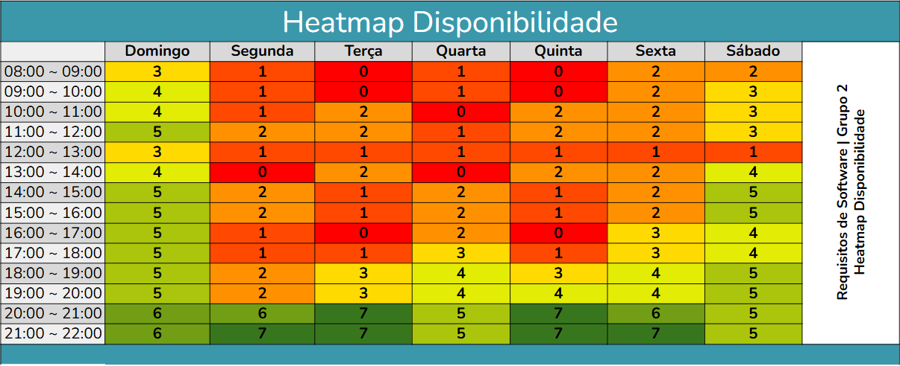

# Heatmap

O Heatmap de Disponibilidade apresenta, de forma visual e colorida, a quantidade de membros disponíveis em cada faixa de horário para cada dia da semana. A escala de cores indica o nível de disponibilidade (das cores mais frias, sugerindo mais disponibilidade, até as mais quentes, sugerindo menos disponibilidade). Dessa forma, é possível identificar rapidamente os períodos em que a equipe tem maior ou menor presença, auxiliando no agendamento de reuniões ou na organização de atividades que dependem de sincronização entre os participantes.

Em virtude dos dados extraídos do heatmap, ficou definido que nossas reuniões de acompanhamento acontecerão todas as terças e quintas a partir das 20h. Essa decisão visa aproveitar os períodos de maior disponibilidade identificados, garantindo uma participação mais efetiva da equipe nas discussões e tomadas de decisão.

| Data       | Versão | Descrição                                 | Autor                                      | Revisor                                     |
| :--------: | :----: | :---------------------------------------- | :----------------------------------------: | :----------------------------------------: |
| 13/04/2025 |  0.1   | (#P01) Incorporando Heatmap de Disponibilidade.| [@Gabriela](https://github.com/gaubiela)   | [@AnaJoyce](https://github.com/anajoyceamorim) |