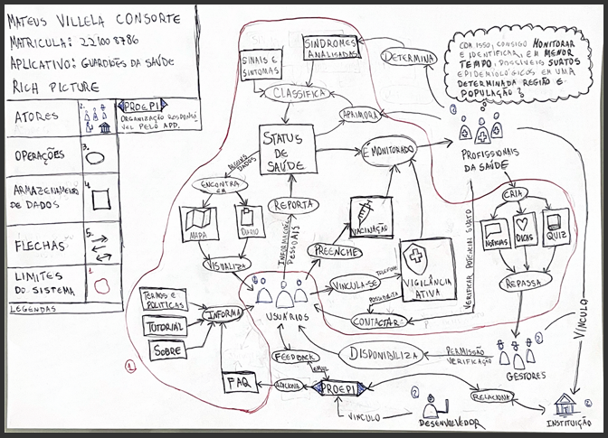

# Rich Picture do Projeto

O Rich Picture do aplicaitvo Guardiões da saúde tem como objetivo apresentar de forma clara e resumida as principais funcionalidades do aplicativo, ale pode ser visto logo em seguida:

# Lista de Verificação - Rich Picture

## (#R01)-1
**Descrição:** O Rich Picture possui legendas explicando os desenhos e formas?

**Avaliação:** Conformidade

**Referência:** Lista de Verificação Conjunta (p.1)

**Responsável:** Ana Borges

---

## (#R01)-2
**Descrição:** Os desenhos e palavras do Rich Picture são identificáveis e legíveis?

**Avaliação:** Conformidade

**Referência:** Lista de Verificação Conjunta (p.1)

**Responsável:** Ana Borges, Ana Joyce

---

## (#R01)-3
**Descrição:** Mostra processos/operações e atividades principais?

**Avaliação:** Conformidade

**Observação:**  Para cada ator identificado, determine as operações, processos ou funções que eles executam no contexto do problema. Em complemento, pode ocorrer de operações serem executadas por outra operação. Geralmente, essas operações são representadas por círculos ou ovais com rótulos descritivos. 

**Referência:** Lista de Verificação Conjunta (p.1, 2, 7, 11, 14, 18)

**Responsável:** Davi, Fábio, Gabriela, Luiz, Ana Borges, Ana Joyce

---

## (#R01)-4
**Descrição:** Usa ícones, desenhos, imagens, Palavras-Chave, Balões de pensamento ou metáforas visuais? 

**Avaliação:** Conformidade

**Observação:** Para reforçar a comunicação, é inclluso elementos visuais (imagens, desenhos, ícones) e 
palavras-chave que ajudem a contar a “história” do problema de forma clara e 
compreensível há todos que o leem.

**Referência:** Lista de Verificação Conjunta (p.3,7,16)

**Responsável:** Davi, Gabriela, Ana Joyce

---

## (#R01)-5
**Descrição:** Representa os fluxos de 
informação ou recursos? 

**Avaliação:** Conformidade

**Observação:** O fluxo de dados é representado com setas que indicam a direção da comunicação entre os elementos do sistema. Utilize setas (com rótulos, se necessário) para mostrar o fluxo de dados ou informações entre atores, operações e depósitos de dados. Isso ajuda a visualizar as relações e interdependências. 

**Referência:** Lista de Verificação Conjunta (p.1, 2, 8,11,15, 18)

**Responsável:** Davi, Fábio, Gabriela, Luiz, Ana Borges, Ana Joyce

---

## (#R01)-6
**Descrição:** A fronteira do sistema está clara? 

**Avaliação:** Conformidade

**Observação:** Estar claro o que está dentro (sistema) e fora (ambiente externo) da fronteira do sistema.  Essa delimitação 
ajuda a distinguir o que está sob controle da equipe do que está fora dela, o qual pode ser ignorada.

**Referência:** Lista de Verificação Conjunta (p.1,3,8,12,16, 19)

**Responsável:** Davi, Fábio, Gabriela, Luiz, Ana Borges, Ana Joyce

---

## (#R01)-7
**Descrição:** Os elementos de armazenamento de dados estão representados? 

**Avaliação:** Conformidade

**Observação:**  É Identificado os depósitos de dados ou fontes de informação necessários para o funcionamento dos processos. Esses elementos costumam ser representados por retângulos ou formas similares.

**Referência:** Lista de Verificação Conjunta (p.1,2,8,12,15, 18)

**Responsável:** Davi, Fábio, Gabriela, Luiz, Ana Borges, Ana Joyce

---

## (#R01)-8
**Descrição:** Todos os atores relevantes estão incluídos?

**Avaliação:** Conformidade

**Observação:** É listado e representado graficamente todos os atores (usuários, clientes e grupos) envolvidos no domínio do problema.

**Referência:** Lista de Verificação Conjunta (p.1,2,8,10,14, 18)

**Responsável:** Davi, Fábio, Gabriela, Luiz, Ana Borges, Ana Joyce

---

## (#R01)-9
**Descrição:** Há no Rich Picture uma inidcação para diferenciar os atores?

**Avaliação:** Conformidade

**Observação:** Atores diferentes são de alguma formar diferenciados entre si.

**Referência:** Lista de Verificação Conjunta (p.1)

**Responsável:** Ana Borges

---

## (#R01)-10
**Descrição:** Evita formalismo excessivo?

**Avaliação:** Conformidade

**Observação:** O diagrama não deve se parecer com fluxograma técnico.

**Referência:** Lista de Verificação Conjunta (p.3,7,12)

**Responsável:** Fábio, Davi, Ana Joyce

---

## (#R01)-11
**Descrição:** É compreensível para leigos? 

**Avaliação:** Conformidade

**Observação:** Mesmo sem conhecimento técnico, a estrutura do Rich Picture permite que qualquer pessoa entenda o funcionamento básico do sistema. Sendo possível analisar os processos de negócio e os dados que eles exigem

**Referência:** Lista de Verificação Conjunta (p.3,7,13,20)

**Responsável:** Fábio, Davi, Luiz, Ana Joyce

---
