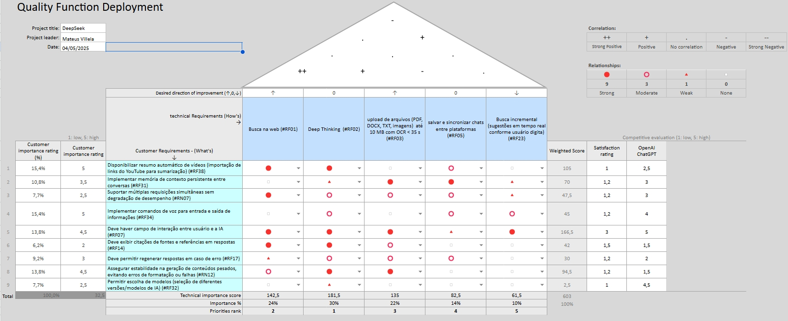

# Resultados da Priorização pelo QFD – DeepSeek

## Introdução

No final da década de 1960, originalmente no contexto da indústria de manufatura e desenvolvido no Japão pelo Yoji Akao, surgiu o *Quality Function Deployment* (QFD) - Desdobramento da Função Qualidade - uma metodologia para auxiliar na tradução das necessidades do consumidor em requisitos de design, garantindo que o produto ou processo desenvolvido atenda a tais expectativas [1, p.3][2]. Nesse contexto, segue-se algumas definições vinculadas a essa técnica de priorização:

- Segundo a *American Society for Quality*, o QFD é definido: “um processo estruturado para planejamento do design de um novo produto ou serviço, ou para reprojetar um existente” [1, p.3,4; tradução própria].
- Para a ISO 16355, QFD é descrito como: “um método para assegurar a satisfação e o valor do consumidor e das partes interessadas em produtos novos e existentes, incorporando, a partir de diferentes níveis e perspectivas, os requisitos que são mais importantes para o consumidor ou para as partes envolvidas” [p.4, tradução própria].
- Já segundo Yoji Akao, autor original, descreve o QFD como a combinação do QD e o QFD de definição restrita [2]. Por um lado, o QD (*Quality Deployment) -* Desdobramento da Qualidade *-* é definido pelo autor como uma metodologia que: “converte as demandas dos usuários em características de qualidade substitutas, estabelecendo a qualidade do design do produto e sistematicamente desdobrando essa qualidade em componentes, peças individuais e elementos de processo” [2, tradução própria]. Por outro lado, o QFD de definição restrita é descrita como uma “Implementação passo a passo de uma função ou operação que incorpora a qualidade nos seus pormenores através da sistematização de objetivos e meios” [2, tradução própria].

O fator principal que caracteriza a eficácia da metodologia QFD, é sua capacidade de capturar e priorizar as necessidades dos consumidores e vinculá-los com os requisitos técnicos [1, p.4]. Essas características possibilitam que o QFD seja usado na avaliação e priorização no contexto da melhoria da qualidade, convertendo-as em requisitos mensuráveis de processo ou produto [1, p.4]. Assim, a técnica QFD agrega o processo de assegurar a qualidade e conjuntamente os pontos de controle de qualidade, utilizando desdobramento de funções encontradas em  engenharia de valor (*Value Engineering*) [1][2].

## Detalhes do Projeto

- **Título:** DeepSeek  
- **Líder do Projeto:** Mateus Villela  
- **Data:** 04/05/2025  
- **Stakeholders**:
    - Kamila Dutra 
        - Residente em: Buenos Aires
        - Curso/Profissão: Medicina 
        - Idade: 20 anos
        - Cliente/Consumidor (Customer)
    - Pedro Bueno
        - Residente em: Buenos Aires
        - Curso/Profissão: Medicina 
        - Idade: 20 anos
        - Cliente/Consumidor (Customer)
    - Janaina
        - Residente em: Barra do Bugres
        - Curso/Profissão: Arquitetura
        - Idade: 20 anos
        - Cliente/Consumidor (Customer)
    - Fábio
        - Residente em: Brasília-DF
        - Curso/Profissão: Engenharia de Software
        - Idade: 21 anos
        - Especialista
    - Luiz Guilherme
        - Residente em: Brasília-DF
        - Curso/Profissão: Engenharia de Software
        - Idade: 20 anos
        - Especialista
    - Mateus Villela
        - Residente em: Brasília-DF
        - Curso/Profissão: Engenharia de Software
        - Idade: 21 anos
        - Especialista

## Metodologia de Priorização

Para o contexto atual, na aplicação do DeepSeek, foi utilizado como uma das técnicas o QFD. Entretanto, o modelo utilizado é uma adaptação do orginial, ou melhor, um simplificação para condizer com a aplicação no âmbito da disciplina. Nesse sentido, segue-se as etapas assoicados a metodologia aplicada:

- **Seleção dos Requisitos elicitados**:
    
    - Diferente das demais técnicas de priorização aplicadas, essa teve que ter um corte de escopo, pois sua complexidade resultaria em um processo ineficiente e demaisado dispendiosa para o contexto da aplicação em questão.
    
    - **Requisitos classificados Técnicos** selecionados
        
        - Busca na web (#RF01)
        
        - Deep Thinking  (#RF02)
        
        - upload de arquivos (PDF, DOCX, TXT, imagens)  até 10 MB com OCR < 35 s (#RF03)
        
        - salvar e sincronizar chats entre plataformas (#RF05)
        
        - Busca incremental (sugestões em tempo real conforme usuário digita) (#RF23)

    - **Requisitos de Consumidor** selecionado
        
        - Disponibilizar resumo automático de vídeos (importação de links do YouTube para sumarização) (#RF38)
        
        - Implementar memória de contexto persistente entre conversas (#RF31)
        
        - Suportar múltiplas requisições simultâneas sem degradação de desempenho (#RN07)
        
        - Implementar comandos de voz para entrada e saída de informações (#RF34)
        
        - Deve haver campo de interação entre usuário e a IA (#RF07)
        
        - Deve exibir citações de fontes e referências em respostas (#RF14)
        
        - Deve permitir regenerar respostas em caso de erro (#RF17)
        
        - Assegurar estabilidade na geração de conteúdos pesados, evitando erros de formatação ou falhas (#RN12)
        
        - Permitir escolha de modelos (seleção de diferentes versões/modelos de IA) (#RF32)
- **Montagem da Casa da Qualidade (House of Quality - QFD)**
    - O **Quality Function Deployment (QFD)** é uma metodologia utilizada para traduzir as necessidades dos clientes (**What’s**) em requisitos técnicos (**How’s**).  
    - A **Casa da Qualidade** é a matriz principal do QFD, que organiza e prioriza essas necessidades.

    - **Estrutura da Casa da Qualidade**  
        - A matriz é composta por diferentes seções que conectam requisitos dos consumidores aos requisitos técnicos:
            - **O que o cliente deseja (What’s)** → São listadas as necessidades dos usuários.
            - **Requisitos técnicos (How’s)** → São as características do produto que atendem às necessidades do cliente.
            - **Relacionamento entre What’s e How’s** → Indica a força da relação entre as necessidades dos usuários e as especificações técnicas.
            - **Correlação entre requisitos técnicos (telhado da matriz)** → Mostra como os requisitos técnicos se influenciam mutuamente.
            - **Importância dos requisitos** → Define o peso relativo de cada necessidade do usuário.
            - **Comparação com concorrentes** → Analisa a posição do produto em relação à concorrência.

    - **Passos para Montagem da Casa da Qualidade**  
        - **1. Identificar as Necessidades do Cliente (What’s)**  
            - Levantar requisitos através de entrevistas, pesquisas e observação.  
        - **2. Listar os Requisitos Técnicos (How’s)**  
            - Traduzir as necessidades do cliente em especificações do produto.  
        - **3. Criar a Matriz de Relacionamento**  
            - Avaliar **a força da relação** entre os requisitos técnicos e as necessidades dos clientes.  
            - Utilizar uma escala como:
            - **0** → Sem relação  
            - **1** → Fraca  
            - **3** → Média  
            - **9** → Forte  
        - **4. Priorizar os Requisitos Técnicos**  
            - Atribuir **pesos** às necessidades dos clientes.  
            - Calcular o **peso relativo dos requisitos técnicos** com base na importância dos What’s e na força da relação.  
        - **5. Analisar a Correlação Entre os Requisitos Técnicos**  
            - Construir o **telhado da Casa da Qualidade**, verificando relações positivas e negativas entre os How’s.  

    - **Análise da Correlação Técnica**  
        - No **telhado da matriz**, avalia-se como os requisitos técnicos influenciam uns aos outros:
            - **Correlação Muito Positiva (++)** → Requisitos que se reforçam fortemente.  
            - **Correlação Positiva (+)** → Requisitos que têm impacto favorável.  
            - **Sem correlação (0)** → Nenhuma influência direta.  
            - **Correlação Negativa (-)** → Um requisito compromete parcialmente o outro.  
            - **Correlação Muito Negativa (--)** → Um requisito prejudica fortemente o outro.

    - **Cálculo de Importance e Weighted Score no QFD**
        1. Importance (Importância)
            - **Definição**: Representa o nível de prioridade de cada requisito do consumidor no QFD.
            - **Cálculo**:
                - Cada requisito do consumidor recebe um **peso**, baseado em sua importância.
                - Os pesos podem ser atribuídos **pelos consumidores ou stakeholders** através de uma escala (exemplo: 1 a 5, ou 1 a 10).
                - A importância final é determinada por:
                    - **Soma** dos valores atribuídos pelos consumidores.
                    - **Conversão** para porcentagem, se necessário:
                    ```math
                    \text{Importância (\%)} = \frac{\text{Peso do Requisito}}{\text{Soma de Todos os Pesos}} \times 100
                    ```

        2. Weighted Score (Pontuação Ponderada)
            - **Definição**: Representa o impacto dos requisitos técnicos em relação à importância dos requisitos do consumidor.
            - **Cálculo**:
                - Os requisitos técnicos recebem **valores de correlação** em relação a cada requisito do consumidor.
                - Normalmente, utilizam-se **símbolos de correlação** (Exemplo: forte, médio, fraco ou nulo).
                - Cada símbolo pode ser convertido para um valor numérico (Exemplo: forte = 9, médio = 3, fraco = 1, nulo = 0).
                - A **Weighted Score** de cada requisito técnico é calculada por:
                    - **Multiplicação da correlação** entre requisitos técnicos e importância do requisito do consumidor:
                    ```math
                    \text{Weighted Score} = \sum (\text{Importância do Consumidor} \times \text{Valor da Correlação})
                    ```
                    - Isso gera um **ranking dos requisitos técnicos**, indicando quais são mais relevantes para atender às demandas dos consumidores.
        3. Technical Importance Score (Pontuação de Importância Técnica)
        - **Definição**: Mede a relevância dos requisitos técnicos em relação ao produto final.
        - **Cálculo**:
            - **Soma dos Weighted Scores** de cada requisito técnico:
                ```math
                \text{Technical Importance Score} = \sum \text{Weighted Score de cada Requisito Técnico}
                ```
            - **Conversão para porcentagem**, se necessário:
                ```math
                \text{Technical Importance (\%)} = \frac{\text{Technical Importance Score}}{\text{Soma de Todos os Technical Importance Scores}} \times 100
                ```
            - Isso ajuda a definir quais requisitos técnicos devem ser priorizados no desenvolvimento do produto.

- **Execução das reuniões com os Stakeholders**
    
    - **Parte 1** - Stakeholders: Consumidores/Clientes
        - Ambiente de Reunião: **Jitsi meet**
        - Data/Hora da Reunião: **21:30h 03/05/2025**
        - Objetivos: Determinação dos pesos vinculados à requistos do consumidor e estabelecimento do *Banchmark*.
    - **Parte 2** - Stakeholders: Especialistas
        - Ambiente de Reunião: **Teams**
        - Data/Hora da Reunião: **16:40h 04/05/2025**
        - Objetivos: 
            - Determinação: 
                - Direções de aproveitamento do requistos técnicos (Topo da Casa da Qualidade).
                - Matriz triangular de Correlação entre os requistos técnicos ("Telhado" da Casa da Qualidade).
                - Corpo de relações (Matriz de relações entre requistos do consumidor e requistos técnicos) da Casa da Qualidade.
            - Resultado Final obtido no QFD
- **Resultado Obtido no QDF para o Deepseek**

## Resultado

<figure style="text-align: center;">
  
  <figcaption><strong>Figura 1.</strong> Casa da Qualidade - QFD - Deepseek.</figcaption>
  <div style="margin-top: 10px; font-size: 14px;">
    Autor: <a href="https://github.com/MVConsorte">@Mateus</a>
  </div>
</figure>


## Conclusão
Segue a tabela de priorização dos requistos Técnicos.

<p align="center"><strong>Tabela 1. Priorização dos Requisitos Técnicos</strong></p>

| **Critério**    | Peso (%) | Rank de Prioridade |
|:--------------:|:--------:|:-----------------:|
| Busca na web   | 24%      | 2                 |
| Deep Thinking  | 30%      | 1                 |
| Upload de arquivos | 22%  | 3                 |
| Sincronização de chats | 14% | 4              |
| Busca incremental | 10% | 5                 |

<p align="center">Fonte: QFD - Google Sheets - Mateus Villela</p>

> ## Bibiligrafia
> 
>1. **ERDIL, Nadiye Ozlem; ARANI, Omid M.** Quality function deployment: more than a design tool. *International Journal of Quality and Service Sciences*, 2018. Disponível em: [https://doi.org/10.1108/IJQSS-02-2018-0008](https://doi.org/10.1108/IJQSS-02-2018-0008). Acesso em: **01 maio 2025**.
> 
> 2. **AKAO, Yoji.** QFD: Past, present, and future. In: *International symposium on QFD*. Linköping, Sweden: International council of QFD, 1997. p. 1-12.


## Autores / Revisores

| Data       |Descrição                                 | Autor                                      | Revisor                                     
| :--------: | :---------------------------------------- | :----------------------------------------: | :----------------------------------------: |
| 04/05/2025 | Técnica de elicitação QFD| [@Mateus](https://github.com/MVConsorte)   | [@Gaubiela](https://github.com/gaubiela) |
