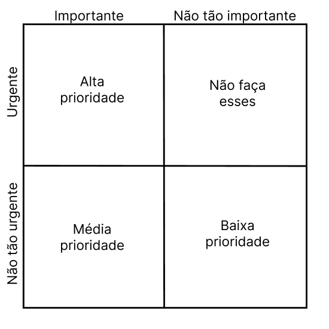

# Técnica de priorização de requisitos: Three Level Scale

Uma forma comum de priorizar os requisitos é dividi-los em três grandes categorias de prioridade: alta, média e baixa, contudo para que ela possa funcionar da forma correta os stakeholders devem concordar em quais são essas prioridades (WIEGERS; BEATTY,  p. 319).
A técnica three level scale transforma essa categorização de requisitos em uma matriz 2x2 que avalia a urgência e a importância de um requisito.

Figura 1: Priorização de requisitos com base na importância e urgência. Fonte: eleboração prórpria.

Assim, os requisitos na técnica three level scale se dividem em:
* Alta prioridade: são requisitos que são importantes, pois os consumidores precisam daquela função, e também urgentes, dado que os consumidores precisam dela na próxima release, assim, pela definição, se o requisito pode ser implementado em uma release futura ele não é de alta prioridade (WIEGERS; BEATTY,  p. 319).
* Média prioridade: são requisitos que são importantes, mas os consumidores não precisam deles de forma tão urgente (WIEGERS; BEATTY,  p. 319).
* Baixa prioridade: são requisitos que não são tão importantes e também tão urgentes.
* Os requisitos no quarto quadrante podem ser considerados urgentes para um determinado stakeholder, talvez por razões políticas, mas eles são importantes para atingir os objetivos de negócio (WIEGERS; BEATTY,  p. 319).. Assim, não é ideal que um tempo seja gasto trabalhando no desenvolvimento deles, pois eles não adicionam valor suficiente para o produto (WIEGERS; BEATTY,  p. 319).

# Aplicando a técnica

Conhecendo como a técnica funciona, ela foi aplicada em reunião online gravada com 4 stakeholders a fim de decidir a prioridade dos requisitos elicitados anteriormente no projeto
Estavam presentes na reunião
* Gabriela: integrante do grupo;
* Luiz: aplicando a técnica de priorização Three Level Scale;
* Fábio: aplicando a técnica de priorização in or out;
* Mateus: aplicando a técnica de priorização QFD;
* Pedro Bueno: estudante de medicina em Buenos Aires, 20 anos de idade, stakeholder 1;
* Janaina: estudante de arquitetura em Barra do Bugres, 20 anos de idade, stakeholder 2;
*  Kamila Dutra: estudante de medicina em Buenos Aires, 20 anos de idade, stakeholder 3.

#### Observações:

As técnicas de produção in or out e three level scale foram aplicadas em conjunto, em que ao passar por um requisito, os stakeholders decidiam se aquele requisito era in ou out mas também o grau de importância, sendo eles: alta, média, baixa ou também optaram por não fazer o desenvolvimento dele (quarto quadrante). Ao fazer isso, foi possível poupar tempo dos integrantes do grupo e dos stakeholders.

## Requisitos Priorizados

1. Deve oferecer a possibilidade do usuário acionar a pesquisa na web \
    **Tipo:** Funcional  
    **Status:** Implementado  
    **Categoria de importância:** Alta prioridade  

2. Deve haver a possibilidade de uso do pensamento profundo para solução de problemas (Deep Thinking) \
    **Tipo:** Funcional  
    **Status:**Implementado  
    **Categoria de importância:** Alta prioridade  

3.  O sistema deve aceitar uploads de arquivos de até 10MB nos formatos PDF, DOCX, TXT e imagens (com OCR) com tempo de resposta < 35s \
    **Tipo:** Funcional  
    **Status:** Implementado  
    **Categoria de importância:** Alta prioridade 

 4. Deve fazer o uso da arquitetura DeepSeek-V3 \
    **Tipo:** Não funcional  
    **Status:** Implementado  
    **Categoria de importância:** Baixa prioridade  

5. Deve possuir versões para Android e IOS \
    **Tipo:** Não funcional  
    **Status:** Implementado  
    **Categoria de importância:** Alta prioridade  

6. Deve possuir a opção de login com conta Google/Apple ID \
    **Tipo:** Funcional  
    **Status:** Implementado  
    **Categoria de importância:** Alta prioridade 

7. Deve salvar chats entre plataformas \
    **Tipo:** Funcional  
    **Status:** Implementado  
    **Categoria de importância:** Média prioridade 

 8. Melhorar as capacidades de "deep thinking" \
    **Tipo:** Funcional  
    **Status:** Não implementado  
    **Categoria de importância:** Média prioridade  

9.  Deve haver um campo para a interação com a IA \
    **Tipo:** Funcional  
    **Status:** Implementado  
    **Categoria de importância:** Alta prioridade

10. Deve ser possível criar novos chats \
    **Tipo:** Funcional  
    **Status:** Implementado  
    **Categoria de importância:** Alta prioridade  

11. Deve ser possível renomear um chat \
    **Tipo:** Funcional  
    **Status:** Implementado  
    **Categoria de importância:** Média prioridade  

12. Os chats já utilizados devem poder se acessados posteriormente \
    **Tipo:** Funcional  
    **Status:** Implementado  
    **Categoria de importância:** Média prioridade  

13. Deve ser possível dar dislike em uma resposta da IA \
    **Tipo:** Funcional  
    **Status:** Implementado  
    **Categoria de importância:** Don't do these!  

14. Deve ser possível dar like em uma resposta da IA \
    **Tipo:** Funcional  
    **Status:** Implementado  
    **Categoria de importância:** Don't do these!  

15. Deve ser possível copiar uma resposta da IA \
    **Tipo:** Funcional  
    **Status:** Implementado  
    **Categoria de importância:** Alta prioridade 

16. Deve exibir citações de fontes e referências em respostas baseadas em documentos, indicando página, site e/ou trecho extraído. \
    **Tipo:** Funcional  
    **Status:** Parcialmente implementado  
    **Categoria de importância:** Baixa prioridade

17. Deve ser possível alterar o idioma do sistema \
    **Tipo:** Funcional  
    **Status:** Implementado  
    **Categoria de importância:** Alta prioridade  

18. Deve ser possível apagar conversas individuais ou de forma geral \
    **Tipo:** Funcional  
    **Status:** Implementado  
    **Categoria de importância:** Baixa prioridade  

19. Deve ser possível regenar uma resposta da IA de forma manual ou de forma automática no caso de erro de servidor ou sobrecargado sistema \
    **Tipo:** Funcional  
    **Status:** Parcialmente implementado  
    **Categoria de importância:** Média prioridade

20. O sistema deve exibir respostas formatadas em Markdown em respostas para tabelas ou listas complexas Markdown (títulos, listas, código) com a possibilidade de edição do Markdown pelo usuário \
    **Tipo:** Funcional  
    **Status:** Parcialmente implementado  
    **Categoria de importância:** Baixa prioridade 

21. Deve ser possível interromper respostas em andamento \
    **Tipo:** Funcional  
    **Status:** Não implementado  
    **Categoria de importância:** Baixa prioridade

22. Deve possuir uma API Pública \
    **Tipo:** Funcional  
    **Status:** Não implementado  
    **Categoria de importância:** Alta prioridade  

23. Deve aceitar autenticação via token de acesso \
    **Tipo:** Funcional  
    **Status:** Implementado  
    **Categoria de importância:** Don't do these! 

24.  Deve guardar um histórico de conversas por 30 dias - O histórico não é persistente se o usuário sair sem salvar
    **Tipo:** Não funcional  
    **Status:** Não implementado  
    **Categoria de importância:** Baixa prioridade

25. Deve fazer a exclusão automática de dados de upload \
    **Tipo:** Não funcional  
    **Status:** Não implementado  
    **Categoria de importância:** Média prioridade 

26. A interface deve seguir diretrizes de usabilidade (botões visíveis, texto legível, feedback imediato) e de acessibilidade (alteração no tamanho da fonte, leitura) \
    **Tipo:** Não funcional  
    **Status:** Não implementado  
    **Categoria de importância:** Alta prioridade 

27. Deve haver uma confirmação para limpar o histórico \
    **Tipo:** Funcional  
    **Status:** Não implementado  
    **Categoria de importância:** Alta prioridade  

28. Em caso de falha, deve retornar mensagens de erro claras \
    **Tipo:** Não funcional  
    **Status:** Implementado  
    **Categoria de importância:** Don't do these! 

 29. O sistema deve suportar múltiplas requisições simultâneas sem degradação \
    **Tipo:** Não funcional  
    **Status:** Implementado  
    **Categoria de importância:** Média prioridade  

30. O processamento de arquivos grandes (PDF/DOCX) deve ocorrer em ≤10 segundos e o tempo médio de resposta deve ser <= 2 s em operações simples \
    **Tipo:** Não funcional \
    **Status:** Parcialmente implementado \
    **Categoria de importância:** Baixa prioridade

31. Deve suportar busca incremental (exibição de sugestões em tempo real conforme o usuário digita). \
    **Tipo:** Funcional  
    **Status:**  Não implementado  
    **Categoria de importância:**  Baixa prioridade  

32. Todos os dados sensíveis do usuário devem ser criptografados em trânsito (TLS) e em repouso (AES-256). \
    **Tipo:**  Funcional  
    **Status:** Implementado  
    **Categoria de importância:** Alta prioridade

33. O usuário deve poder controlar quais dados são compartilhados (chat, histórico de buscas, localização). \
    **Tipo:** Funcional  
    **Status:** Não implementado  
    **Categoria de importância:** Média prioridade  

34. Deve haver autenticação multifator opcional para acesso a funcionalidades avançadas. \
    **Tipo:** Funcional  
    **Status:** Não implementado  
    **Categoria de importância:** Don't do these!

35. Deve oferecer modo escuro e modo claro, com configuração manual e sincronização automática com o sistema operacional. \
    **Tipo:** Funcional  
    **Status:** Implementado  
    **Categoria de importância:** Alta prioridade  

36. Deve incluir tutorial interativo na primeira execução, explicando as principais funcionalidades. / Implementar tutorial interativo (tour guiado) destacando recursos avançados (DeepThink, Reason etc.) no onboarding. \
    **Tipo:** Funcional  
    **Status:** Não implementado  
    **Categoria de importância:** Baixa prioridade 

 37. Disponibilizar, no próprio app, informações claras e acessíveis sobre como e onde os dados são armazenados e utilizados. \
    **Tipo:** Não funcional  
    **Status:** Não implementado  
    **Categoria de importância:** Don't do these! 

38. Especificar e permitir ao usuário optar por participar ou não do uso de seus dados em processos de re-treinamento ou venda de modelos. \
    **Tipo:** Não funcional  
    **Status:** Não implementado  
    **Categoria de importância:** Alta prioridade  

39. Exibir status do servidor em tempo real (Online, Manutenção, Sobrecarga). \
    **Tipo:** Funcional  
    **Status:** Não implementado  
    **Categoria de importância:** Don't do these!

40. Melhorar retenção de contexto em diálogos longos para evitar “esquecimento” ou mistura de informações previamente dadas. \
    **Tipo:** Funcional  
    **Status:** Parcialmente implementado  
    **Categoria de importância:** Média prioridade   

41.  Garantir estabilidade na geração de conteúdos pesados (PDF, cálculos), evitando erros de formatação ou falhas. \
    **Tipo:** Não funcional  
    **Status:** Parcialmente implem.  
    **Categoria de importância:** Média prioridade  

42. Implementar memória de contexto persistente entre conversas. \
    **Tipo:** Funcional  
    **Status:** Não implementado  
    **Categoria de importância:** Média prioridade 

 43. Permitir escolha de modelos (seleção de diferentes versões/modelos de IA). \
    **Tipo:** Funcional  
    **Status:** Não implementado  
    **Categoria de importância:** Média prioridade

44. Permitir organização de conversas em pastas ou listas por tema ou projeto. \
    **Tipo:** Funcional  
    **Status:** Não implementado \
    **Categoria de importância:** Média prioridade  

45. Implementar comandos de voz para entrada e saída de informações. \
    **Tipo:** Funcional  
    **Status:** Não implementado  
    **Categoria de importância:** Alta prioridade  

46. Atingir ≥ 95 % de usuários avaliando a usabilidade como “Fácil” ou “Muito fácil” em pesquisas futuras. \
    **Tipo:** Não funcional  
    **Status:** Parcialmente implementado  
    **Categoria de importância:** Baixa prioridade

47. Alcançar ≥ 90 % de concordância em “Interface clara e agradável” em pesquisas futuras. \
    **Tipo:** Não funcional  
    **Status:** Não implementado  
    **Categoria de importância:** Baixa prioridade 

48. Reduzir para ≤ 5 % os usuários que relatam dificuldade em encontrar opções/ferramentas em pesquisas futuras. \
    **Tipo:** Não funcional  
    **Status:** Não implementado  
    **Categoria de importância:** Baixa prioridade  

49. Ajustar visualização do título ao passar o mouse sobre o nome do chat na barra lateral de histórico para que não cubra outros elementos e posicione em local adequado. \ 
    **Tipo:** Funcional  
    **Status:** Não implementado  
    **Categoria de importância:** Don't do these! 

50. Fornecer, na interface de envio de imagens, instruções claras e contextualizadas sobre OCR (explicar siglas e limitações). \
    **Tipo:** Funcional  
    **Status:** Não implementado  
    **Categoria de importância:** Média prioridade

51. Conectar nativamente a ferramentas populares (Google Drive, Google Agendas, Outlook, GitHub etc.) via integrações diretas. \
    **Tipo:** Funcional  
    **Status:** Não implementado  
    **Categoria de importância:** Média prioridade  

52. Disponibilizar resumo automático de vídeos (importação de links do YouTube para sumarização). 
    **Tipo:** Funcional  
    **Status:** Não implementado  
    **Categoria de importância:** Alta prioridade 

# Considerações finais

Com base na técnica de priorização de requisitos foram capaz de classificar os 52 requisitos elicitados anteriormente em quatro categorias, 17 requisitos foram classificados como muito importantes e de alta prioridade, 15 requisitos foram considerados pelos stakeholders como requisitos de média prioridade, 12 requisitos foram de baixa prioridade, não sendo tão urgentes para os consumidores e não tão importantes. Além disso, 8 requisitos foram para a quarta categoria, que não apresentam valor para o produto final desenvolvido.

# Bibliografia

1. WIEGERS, K; BEATTY, J. Software Requirements. 3. ed. Redmond: Microsoft Press, 2013.

# Link para o documento em versão PDF

https://docs.google.com/document/d/1Xos-q7mQ_vuDQqeCBLC7N5xdxEBLVYF27pExJdWrvOg/edit?usp=sharing

  

 

    

 

 

